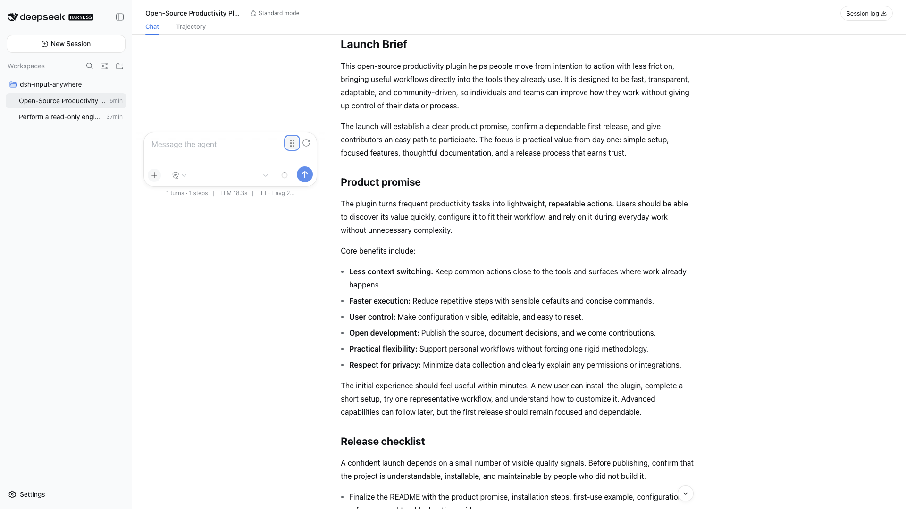
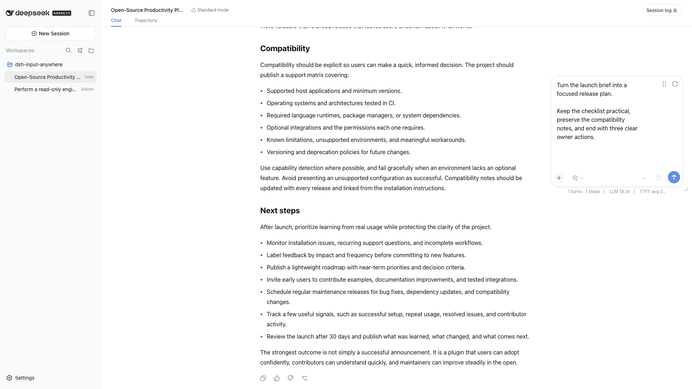
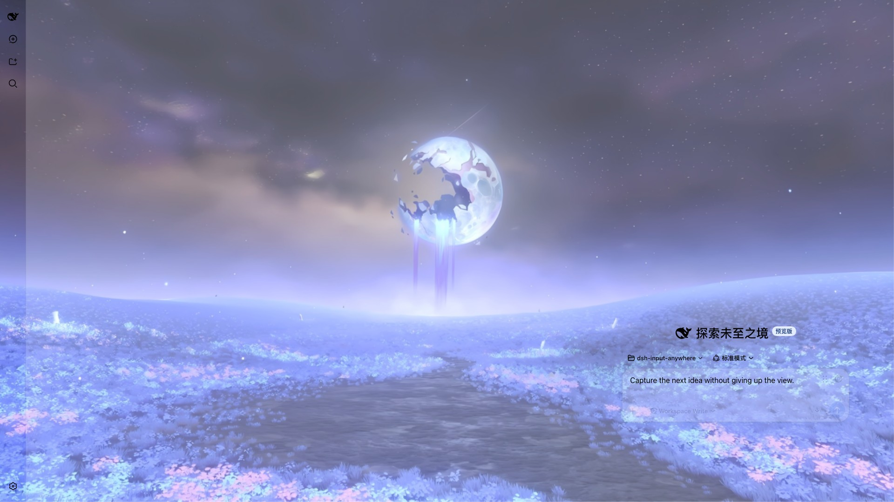

# dsh-input-anywhere

在不替换输入状态机的前提下，移动和缩放 DeepSeek Harness Web 原生输入区。

[English](README.md)

> **发布状态：** 当前源码和 Changelog 已按 DeepSeek Harness `0.1.0-rc.7` 准备为 `v0.1.1`；在该版本发布到 npm 前，`latest` 仍为 `0.1.0`。插件同时依赖 Slot 契约和少量当前稳定的 composer DOM marker。用于其他 DSH 版本或替换 composer 前，请阅读[兼容性契约](docs/compatibility.md)。

## 工作方式

插件在 `conversation.input.left` 中注册一个小型移动控件。启用后，它会将完整的原生 `data-composer-seat` 设为浮动，而不是创建第二个 textarea，也不会替换 `conversation.composer.bar`。

因此，下列能力仍处于原 React 树中并会一起移动：

- 草稿、IME、选区、撤销/重做、命令和引用；
- 附件、accessory、notice、队列和 steering；
- 权限、Plan、模型、上下文、发送和停止控件；
- `conversation.input.left/right/dock` 与 `conversation.composer.dock` 扩展贡献。

## 使用效果

### 不遮挡正在阅读的回答

把原生输入框放到长回答旁边，而不是压住正在阅读的段落。草稿、模型控件和完整对话仍由 DSH 原生树管理。



### 给长输入留出空间

把同一个输入框纵向扩展，并移动到对话另一侧。回答保持可见，草稿也获得足够的编辑空间。



### 融入当前工作区

输入框继承主题表面，可以自然进入自定义 DSH 工作区，而不接管背景插件，也不替换编辑器。



## 已验证能力

- 鼠标、触摸和笔输入使用 Pointer Events 与 pointer capture。
- 四角缩放，并根据附件和扩展行动态计算最小高度。
- 方向键移动/缩放；按住 `Shift` 时以 1 px 调整。
- 聚焦缩放角后，可使用 `Enter` 或空格从该方向扩大 10 px。
- 窗口、方向、软键盘和 Visual Viewport 变化后重新限制位置。
- 左右边缘吸附，并跟随 conversation 边界移动。
- 根据 composer 容器宽度避免权限、扩展菜单、模型和插件控件重叠。
- 独立的 DSH 设置页面，包含实时总开关、输入表面与控件透明度模式、恢复默认值以及中英文标签。
- 空闲时精确跟随 DSH 主题 alpha；只有浮动 seat 与当前 `[data-chat-flow]` 相交时，才应用分别配置的空闲/输入态策略。
- 使用 Host 用户设置；Host namespace 暂不可用时保持浏览器本地可写，并在恢复后自动迁移。
- 布局使用版本化 `localStorage`，在交互完成、页面隐藏和卸载时刷新最新值。
- 粗指针设备使用 44 px 目标尺寸。
- 浮动时释放原生 trajectory 的 composer 底部占位，复位后恢复。
- 停止或卸载时清理插件拥有的 class、属性、样式、观察器、监听器、计时器和动画帧。

## 兼容性

| 组件 | 状态 |
| --- | --- |
| DeepSeek Harness `0.1.0-rc.6` 和 `0.1.0-rc.7` | 已验证 |
| Cordis `4.0.1` | 已验证 |
| React / React DOM 18 | 已通过 DSH Web profile 验证 |
| Chromium 细指针 | Playwright 自动化覆盖 |
| Chromium 粗指针模拟 | Playwright 自动化覆盖 |
| Firefox / WebKit | 暂不声明支持 |
| 替换 composer | 有条件兼容 |

Peer dependency 允许 `<0.2.0` 的兼容 DSH 版本，但这不表示所有版本均已测试。完整条件见 [docs/compatibility.md](docs/compatibility.md)。

## 安装

已发布包：

```sh
dsh plugin --profile web add dsh-input-anywhere
```

在 `0.1.1` 发布到 npm 前，该命令仍会安装 registry `latest`（`0.1.0`），而不是本仓库中已审计的源码版本。

本地仓库：

```sh
pnpm install
pnpm check
dsh plugin --profile web add /absolute/path/to/dsh-input-anywhere
```

添加或删除插件后需要重启 Web profile。DSH 在进程启动时解析包 manifest 和 Client 插件名册。

卸载：

```sh
dsh plugin --profile web remove dsh-input-anywhere
```

## 使用

| 控件 | 指针操作 | 键盘操作 |
| --- | --- | --- |
| 六点移动控件 | 单击进入浮动；拖拽移动 | 方向键移动 10 px；`Shift` + 方向键移动 1 px；`Escape` 复位 |
| 四角缩放控件 | 从对应角拖拽 | 方向键缩放 10 px；`Shift` + 方向键缩放 1 px；`Enter`/空格从该角扩大 10 px |
| 复位控件 | 单击恢复原生停靠 | 按普通按钮方式聚焦并激活 |

移动到左右可用边界 24 px 范围内会产生持久吸附。侧边栏、详情区或视口改变后，吸附的输入框会跟随对应边界。

### 设置

打开 **设置 → 输入框位置与外观**。默认值为：

| 设置 | 默认值 |
| --- | --- |
| 功能总开关 | 开启 |
| 输入框表面 | 跟随解析后的 DSH 主题 alpha |
| 输入框控件 | 跟随输入框有效透明度 |
| 遮挡输出自动调整 | 开启 |
| 遮挡输出且空闲 | 精确跟随输入框 |
| 遮挡输出且正在输入 | 自定义 92% 不透明度 |

关闭功能总开关会执行与工具栏恢复按钮相同的原生停靠复位并持久化 docked 状态，重新开启时不会恢复旧浮动位置。每个表面状态也可选择不透明或自定义 20–100%。textarea 聚焦或官方 DSH 输入状态存在非空草稿时视为“正在输入”。输入框处于原生停靠状态，或浮动 seat 未与当前 conversation 的 `[data-chat-flow]` 相交时，遮挡策略不会生效。

## 持久化与隐私

布局保存于浏览器的 `dsh-input-anywhere:layout:v1`。启用状态和外观设置使用 Host 的 `dsh-input-anywhere` 用户设置 namespace。每次修改都会先进入 `dsh-input-anywhere:preferences:v1` 写前日志；经 Host snapshot 确认的字段会逐项删除，拒绝、冲突、部分完成或卸载中断的操作则保留等待重试。迁移只重放实际修改的字段，不会覆盖其他 Host 设置。浏览器存储被策略阻止时，设置仍可在当前页面使用，设置页会明确提示无法跨页面保留。

这些记录只包含布局几何和上表所列设置，不包含提示词、消息、工作区路径、模型名称或账户数据。插件不直接发起网络请求；Host 设置使用 DSH 正常设置传输。

损坏、过期或被浏览器策略禁止的存储会被忽略；当前挂载周期内的交互仍可继续。在浏览器策略允许时，已完成的交互、复位、`pagehide` 和插件卸载都会刷新最新布局，其中复位会立即持久化。

## 扩展兼容规则

插件移动整个原生 seat，并会：

- 计入附件或扩展新增的普通文档流子行的 border-box 高度和垂直 margin；
- 观察浮动后新增、删除、改变尺寸或样式的 card 子节点；
- 动态接管 `[data-chat-flow]` 的插入/移除，并将同一帧的事件和 observer 几何工作合并为一次；
- 在极窄 card 下统一压缩 trailing 区域中带 `aria-haspopup="menu"` 的菜单控件，而不猜测某个按钮的所有者；
- marker 延迟出现或祖先被替换后重新发现 composer；
- 仅在浮动状态继承透明的 `--dsw-alias-bg-layer-1`、`--dsw-alias-bg-layer-2` 或 `--dsw-alias-bg-base` 表面；
- 将 `conversation.input.dock` 中的任务/Todo、Goal、Queue 以及 seat 内菜单限制在同一透明层级；
- 监听 composer 祖先的外观变化，并且只移除 `dsh-input-anywhere-*` 自有标记。

替换 composer 必须保留兼容性文档所列 marker 层级。marker 缺失时，控件不会修改 composer。若祖先通过 `transform`、`filter`、`perspective` 或强 containment 建立 fixed containing block，插件会保持原生停靠，因为此时直接使用视口坐标会产生错误位置。

外观兼容只读取继承的 DSH theme token，不识别也不修改其他插件。解析后的 DSH card/主表面颜色会转换为插件自有的 paint 值，避免覆盖 token 时产生 CSS 变量循环；浮动 card 以及 seat 内的任务/Todo、Goal、Queue 和菜单保留所选层级。插件不会给完整 seat 或 editor 设置 `opacity`，因此文字、焦点样式和命中测试不受影响；当控件选择“跟随输入框”或“自定义”时，仅浮动 card 内的按钮和 select 会按用户选择改变 opacity。顶栏 Subagent/Jobs 菜单、portal overlay 和 seat 外部区域仍由各自模块负责。如果外观扩展在浮动后开启会建立 fixed containing block 的 blur/filter，输入区会安全返回原生停靠。

## 无障碍

移动、复位和四角缩放均使用原生按钮。控件可通过键盘访问，具有可读名称；缩放角名称包含当前宽高。焦点样式使用 DSH theme token，粗指针目标扩大至 44 px。

当前项目不声明已达到 WCAG 或完成屏幕阅读器认证。无障碍回归按缺陷处理，报告时请附浏览器和辅助技术版本。

## 故障排查

### 设置正在使用浏览器回退

仅热更新 Client 无法注册新的 Host 设置 namespace。页面仍可通过本地回退写入；重新构建或安装 Host 改动后重启 Web profile，值会自动迁移到 DSH 用户设置文档。

## 开发与验证

要求 Node.js `>=22.19`、pnpm `10.16.1` 和 Chromium。

```sh
pnpm install
pnpm exec playwright install chromium
pnpm typecheck
pnpm test
pnpm test:browser
pnpm build
pnpm check
```

使用系统 Chromium：

```sh
PLAYWRIGHT_CHROMIUM_EXECUTABLE=/path/to/chromium pnpm test:browser
```

`pnpm check:quick` 不启动浏览器；`pnpm check` 是完整发布门禁。

开发 HMR 需要当前仓库的 `pnpm watch` 和一个已启用 Client HMR receiver 的 DSH Web 进程。profile 中首次安装仍需重启。

## 文档

- [架构](docs/architecture.md)
- [兼容性契约](docs/compatibility.md)
- [测试与发布验证](docs/testing.md)
- [开源调研](docs/research.md)
- [贡献指南](CONTRIBUTING.md)
- [安全策略](SECURITY.md)
- [变更日志](CHANGELOG.md)

## 许可证

MIT，见 [LICENSE](LICENSE)。本仓库未复制调研项目的第三方源码。
